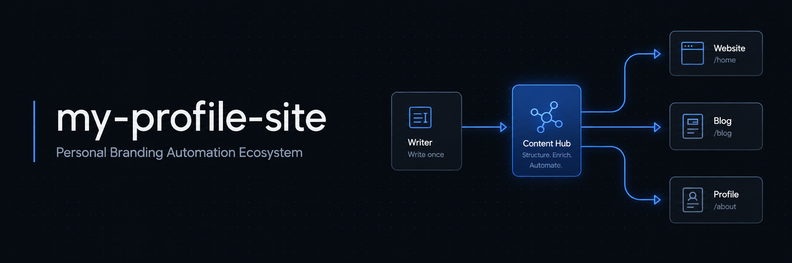
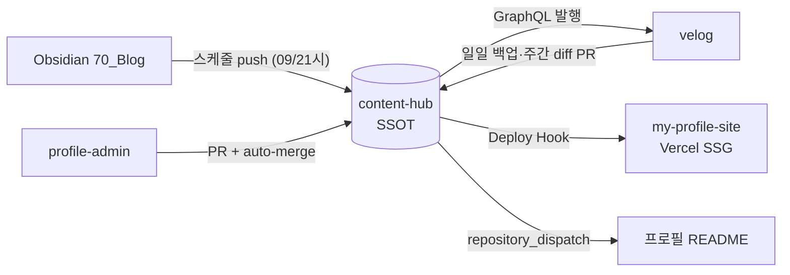
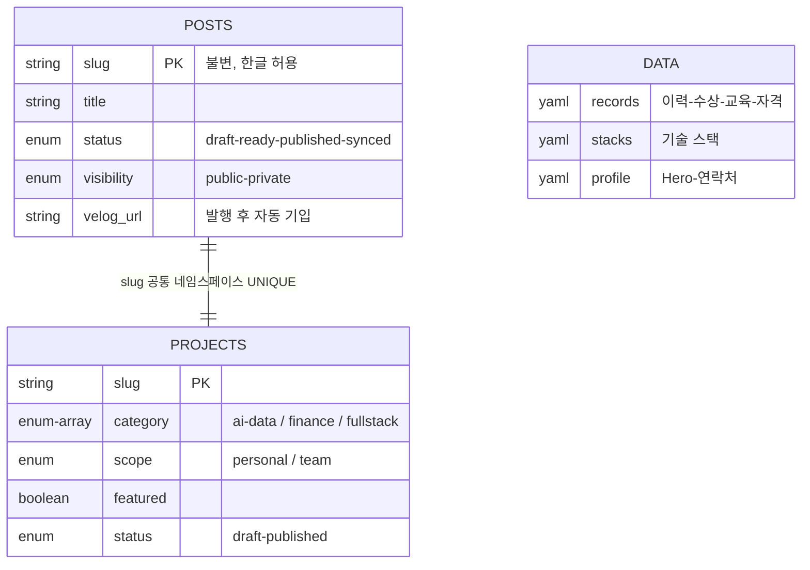

<div align="center">

<!-- 배너 갱신 프롬프트: docs/md/_research/GPT-Image-2.0_README_이미지_프롬프트.md (로컬 전용) -->


# my-profile-site

**이동원 프로필 사이트** — 개인 브랜딩 자동화 생태계의 퍼블릭 얼굴

[](https://nextjs.org)
[](https://www.typescriptlang.org)
[](https://tailwindcss.com)
[](https://my-profile-site-coral.vercel.app)

[사이트 보기](https://my-profile-site-coral.vercel.app) · [블로그(velog)](https://velog.io/@kik328288) · [콘텐츠 저장소(content-hub)](https://github.com/mygithub05253/content-hub)

</div>

---

## 생태계 전체 구조

이 사이트는 단독 프로젝트가 아니라, **글 한 편을 쓰면 velog 발행 → 사이트 재빌드 → GitHub 프로필 README 갱신까지 사람 개입 0회로 전파되는 4-레포 자동화 생태계**의 일부입니다. 전체 흐름을 보려면 아래 순서로 읽는 것을 권장합니다.

| 영역 | 레포 | 역할 | 포트폴리오 포인트 |
|---|---|---|---|
| 콘텐츠 허브 (SSOT) | [content-hub](https://github.com/mygithub05253/content-hub) | 모든 글·프로젝트 콘텐츠의 단일 원본. frontmatter 스키마 CI 검증(L1), velog 자동 발행, 재빌드 트리거를 담당합니다. | DB 없이 git 자체를 콘텐츠 DB·감사 로그로 쓰는 설계입니다. PR이 트랜잭션 역할을 합니다. |
| 프로필 사이트 | **my-profile-site** (이 레포) | Next.js 15 정적 생성 사이트. 콘텐츠를 빌드 시점에 clone해 블로그·프로젝트를 SSG로 서빙합니다. | 콘텐츠와 코드의 완전 분리 — 이 레포에는 글이 한 편도 없습니다. |
| 역방향 백업 | [velog-backup](https://github.com/mygithub05253/velog-backup) | velog에서 직접 수정된 글을 일일 백업 + 주간 diff PR로 역동기화합니다. | 자동화의 사각지대(외부 편집)까지 닫는 양방향 동기화입니다. |
| 프로필 README | [mygithub05253](https://github.com/mygithub05253/mygithub05253) | 최신 글 5개가 자동 반영되는 GitHub 프로필. dispatch 즉시 갱신 + 일일 백스톱 이중 경로입니다. | 실패 시 자동 복구되는 백스톱 설계입니다. |
| 관리자 웹 | [profile-admin](https://github.com/mygithub05253/profile-admin) | GitHub API로 content-hub에 커밋하는 서버리스 CMS. DB 없이 PR + auto-merge로 저장합니다. | 인증 경계(OAuth allowlist 1인)를 별도 레포로 분리한 구조입니다. |

## 아키텍처

콘텐츠가 전파되는 핵심 루프입니다. 상세 설계(시퀀스 4종·장애 시나리오 6종·ADR 11건)는 로컬 설계 문서(`docs/md/architecture/`)에서 관리합니다.



- **무서버·무DB**: 상태는 전부 git, 연산은 GitHub Actions + Vercel 빌드
- **독립 실패**: velog(비공식 API)가 파손돼도 사이트·README 채널은 영향 없음
- **품질 게이트 2중**: content-hub CI(L1 frontmatter 검증) → 사이트 빌드(L2 Velite zod)

## 콘텐츠 스키마 (ERD)

RDB 대신 **frontmatter가 스키마** 역할을 합니다 (컬렉션=테이블, 필드=컬럼, slug=PK).



- 노출 조건: `visibility: public` + `status: published|synced`
- 검증 3계층: L1(CI, 병합 차단) → L2(Velite zod, 배포 차단) → L3(발행 검증)
- 전체 스키마 명세(필드 제약 C-1~3·P-1~7, 상태 전이 모델)는 `docs/md/erd/`에서 관리합니다

## 기술 스택

- **Next.js 15** (App Router, Server Component 우선) + **TypeScript** (Strict, `any` 금지)
- **Tailwind CSS v4** — 디자인 토큰(Signal 듀얼 테마)은 CSS 변수 + `@theme` 브리지
- **Velite** — 콘텐츠 계층 (Turbopack 비호환 → `velite build && next build` 순서 고정)
- **next/og** — 글별 OG 썸네일 빌드 시 자동 생성 (한글 폰트 서브셋 로드)

## 빌드 파이프라인

콘텐츠의 SSOT는 [content-hub](https://github.com/mygithub05253/content-hub)이며, 이 레포에는 글을 두지 않습니다.

```
npm run build
  ① scripts/sync-content.mjs  → content-hub를 .content-hub/로 shallow clone/pull
  ② velite build              → frontmatter 검증(zod) + HTML 변환 (.velite/)
  ③ next build                → 블로그·프로젝트 전 페이지 SSG (+OG 이미지)
```

content-hub에 콘텐츠가 병합되면 Vercel Deploy Hook이 자동으로 재빌드를 트리거합니다.

## 실행 방법

```bash
npm install
npm run dev     # 콘텐츠 동기화 + 개발 서버 (http://localhost:3000)
npm run build   # 프로덕션 빌드 (위 3단계)
npm run start   # 빌드 결과 서빙
```

## 문서

설계 문서는 `docs/` 폴더에서 6도메인 × 3종 세트(통합본·요약본·변경사항) 체계로 관리하며, Obsidian Vault에도 미러링합니다. 설계 과정을 투명하게 공개하기 위해 레포에 커밋되어 있습니다(2026-07-06부터, profile-admin·content-hub도 동일 원칙 적용). 각 도메인 폴더의 `README.md`가 내용물과 버전 관리 방식을 안내합니다.

| 도메인 | 내용 |
|--------|------|
| `docs/md/overview/` | 프로젝트 개요서 |
| `docs/md/features/` | 기능명세서 (사용자 FR-V / 관리자 FR-A·FR-M) |
| `docs/md/erd/` | 콘텐츠 스키마 명세서 |
| `docs/md/api/` | API 명세서 (velog GraphQL·GitHub·Vercel·admin 라우트) |
| `docs/md/architecture/` | 시스템 아키텍처 설계서 + ADR 11건 |
| `docs/md/ui/` | UI 설계서 + 디자인 토큰(DESIGN.md) |

## 로드맵

- [x] Phase 1~3: 자동화 생태계 E2E 100% (발행→재빌드→README 전파)
- [x] 설계 정본화: 6도메인 16문서 + 상세 검토(결함 10건 반영) + 리서치 4건 반영
- [x] PR-A: content-hub projects 스키마 + CI 검증 확장
- [x] PR-B~D: 사이트 재설계 (Signal→Warm Paper 디자인 전환, /projects 목록·상세, 홈 재구성)
- [x] 프로젝트 콘텐츠 게재 (10/11건 published, 1건 draft)
- [x] profile-admin: 서버리스 관리자 웹 초기 구현 (별도 레포, FR-M16~M24 진행 중)
- [ ] content-hub: Dacon처럼 한 폴더에 여러 프로젝트(대회)가 있는 경우의 서브프로젝트 스키마 확장 (별도 설계 대기)
- [ ] 사용자 화면 개선 4건: Star 프로젝트·Core Stack 분야별 그룹핑·Blog 홈 섹션 정리·프로젝트 상세 재설계 — 설계 노트: [`docs/md/_changes/사용자화면_개선4건_설계노트_2026-07-06.md`](./docs/md/_changes/사용자화면_개선4건_설계노트_2026-07-06.md)

## 협업 규칙

- `main` 직접 커밋 금지 — 작업 브랜치 → PR → 병합
- 커밋 메시지·문서는 한국어, Conventional Commits (`feat:`, `fix:`, `docs:` …)
- PR에는 작업 내용과 검증 명령어(빌드 결과)를 기재
