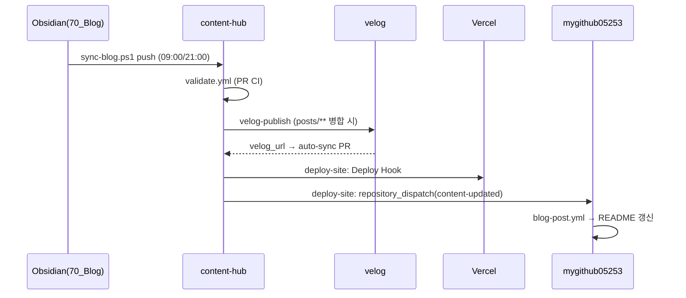

# 연동 API 통합명세서 v1.0

> **프로젝트:** 개인 브랜딩 자동화 생태계 + 프로필 사이트
> **작성일:** 2026-07-04 (KST) | 상태: ■ 확정 (§2~§5 as-built, §6 profile-admin은 계약 초안)
> 본 시스템은 자체 백엔드 서버가 없다. 본 명세서는 **외부 API 소비 계약**(velog GraphQL·GitHub·Vercel)과 **워크플로 간 이벤트 계약**, 그리고 신규 기획 **profile-admin의 내부 API 계약**을 정의한다.

## 목차

1. [API 지형도](#1-api-지형도)
2. [velog GraphQL API (비공식)](#2-velog-graphql-api-비공식)
3. [GitHub API](#3-github-api)
4. [Vercel Deploy Hook](#4-vercel-deploy-hook)
5. [워크플로 이벤트 계약](#5-워크플로-이벤트-계약)
6. [profile-admin 내부 API 계약 (초안)](#6-profile-admin-내부-api-계약-초안)
7. [인증·토큰 관리 총괄](#7-인증토큰-관리-총괄)
8. [공통 에러 처리 정책](#8-공통-에러-처리-정책)

---

## 1. API 지형도

| # | API | 방향 | 호출자 | 인증 | 상태 |
|---|-----|------|--------|------|------|
| A-1 | velog GraphQL | 소비 | content-hub velog-publish / velog-backup 일일 백업 | Cookie (refresh→access) | ✅ 운영 |
| A-2 | GitHub Contents/Git API | 소비 | velog-backup 역방향 PR, sync-blog.ps1, (예정) profile-admin | PAT / OAuth | ✅ 운영 |
| A-3 | GitHub repository_dispatch | 발신 | content-hub deploy-site → mygithub05253 | CONTENT_DISPATCH_TOKEN | ✅ 운영 |
| A-4 | Vercel Deploy Hook | 발신 | content-hub deploy-site | URL 자체가 비밀 | ✅ 운영 |
| A-5 | velog RSS | 소비 | mygithub05253 blog-post.yml | 없음 (공개) | ✅ 운영 |
| A-6 | profile-admin Route Handlers | 제공 | 관리자 브라우저 | GitHub OAuth (1인) | 🔶 설계 |

## 2. velog GraphQL API (비공식)

> Endpoint: `https://v3.velog.io/graphql` · **비공식 API — 파손 리스크 상존** (8.3 폴백 정책 필수)

### 2.1 인증 시퀀스

1. Secret `VELOG_REFRESH_TOKEN` (30일 수명, 만료 2026-08-02)으로 access_token 자동 재발급
2. 요청 헤더: `Cookie: access_token=...; refresh_token=...` — **Cookie 인증만 지원** (Bearer 불가)
3. 재발급 실패 시: 워크플로 실패 처리 + 수동 갱신 안내 (토큰 캘린더 §7)

### 2.2 발행 (write_post mutation)

| 항목 | 값 |
|------|-----|
| operationName | **필수** (누락 시 실패) |
| 필수 변수 | `title`, `body`, `tags`(배열, **생략·문자열 금지**), `is_private`, `url_slug`, `meta`(**필수 객체**) |
| 응답 판정 | `data.writePost == null` ⇒ **실패로 간주** (HTTP 200이어도) |
| 성공 후처리 | 응답의 velog URL을 frontmatter `velog_url`에 기입 → auto-sync 브랜치 커밋 → PR |

### 2.3 제약 및 스로틀

- **5분 내 공개 글 10개 초과 발행 시 자동 비공개 처리** → 백필·대량 발행은 스로틀(간격 발행) 필수
- url_slug는 velog가 소문자 변환하지 않음 — slug 원문 보존 (스키마 명세서 §6)

### 2.4 발행 대상 경로 필터 (PR-A 신설 규칙)

- velog-publish 트리거 경로: `posts/**` 만. **`projects/**` 는 발행 대상에서 제외** (프로젝트는 velog 콘텐츠 아님)
- auto-sync 브랜치발 병합 커밋은 발행 스킵 (루프 가드 — 검증 완료 2026-07-03)

### 2.5 백업 조회 (velog-backup 일일)

- 사용자 글 목록/본문 쿼리로 전량 백업. 역방향 흐름은 주간 워크플로가 content-hub와 diff 후 PR 생성

## 3. GitHub API

### 3.1 repository_dispatch (README 즉시 갱신)

| 항목 | 값 |
|------|-----|
| 요청 | `POST /repos/mygithub05253/mygithub05253/dispatches` |
| Body | `{ "event_type": "content-updated" }` |
| 인증 | `CONTENT_DISPATCH_TOKEN` (fine-grained PAT, **mygithub05253 레포 스코프 필수** — 403 결함 이력) |
| 수신측 | blog-post.yml `on: repository_dispatch: types: [content-updated]` + 일일 스케줄 병행 |

### 3.2 Contents API (profile-admin 저장 계약)

profile-admin은 DB 없이 아래 계약으로 content-hub에 직접 커밋한다.

| 작업 | 엔드포인트 | 비고 |
|------|-----------|------|
| 조회 | `GET /repos/{owner}/content-hub/contents/{path}` | `sha` 확보 (수정·삭제 시 필수) |
| 생성/수정 | `PUT /repos/{owner}/content-hub/contents/{path}` | base64 content + message + (수정 시) sha |
| 삭제 | `DELETE .../contents/{path}` | sha 필수 |
| 목록 | `GET .../contents/projects` | 디렉터리 리스팅 |

- **동시성**: sha 불일치 409 ⇒ 재조회 후 재시도 1회, 그래도 실패면 사용자에게 충돌 표시 (낙관적 잠금)
- **브랜치 정책**: P0에서는 main 직접 커밋 허용 여부를 사용자 결정으로 유보 — 기본안은 `admin/*` 브랜치 + PR 자동 생성 (레포 Git 규칙과 일관)

### 3.3 blog-post.yml (README 갱신)

- RSS(`https://v2.velog.io/rss/@kik328288`) 파싱 → `<!-- BLOG-POST-LIST:START/END -->` 마커 치환 → push
- **`permissions: contents: write` 명시 필수** (기본 GITHUB_TOKEN read-only 403 결함 이력, PR #2로 수정)

## 4. Vercel Deploy Hook

| 항목 | 값 |
|------|-----|
| 요청 | `POST {VERCEL_DEPLOY_HOOK_URL}` (Secret, body 불요) |
| 호출자 | content-hub deploy-site 워크플로 (posts/projects 변경 병합 시) |
| 효과 | my-profile-site 재빌드 → sync-content가 최신 content-hub clone → SSG 재생성 |
| 실패 정책 | Hook 응답 2xx 아니면 잡 실패 표시 (사이트는 이전 배포 유지 — 안전) |

## 5. 워크플로 이벤트 계약

| 이벤트 | 발신 → 수신 | 트리거 조건 | 루프 가드 |
|--------|-------------|-------------|-----------|
| E-1 push(콘텐츠) | 로컬/관리자 → content-hub | posts/·projects/ 변경 | — |
| E-2 velog 발행 | content-hub 내부 | E-1 병합, posts/** 한정 | auto-sync발 커밋 스킵 |
| E-3 재빌드 | content-hub → Vercel | E-1 병합 | — |
| E-4 dispatch | content-hub → mygithub05253 | E-1 병합 | 일일 스케줄이 백스톱 |
| E-5 역방향 백업 | velog-backup → content-hub | 주간 (월 09:00 KST) | 브랜치 `auto-sync-velog-backup` (평면명 — ref 충돌 결함 이력) |

## 6. profile-admin 내부 API 계약 (초안)

> Next.js Route Handlers. 모든 라우트는 인증 미들웨어 통과 필수. 상세 화면은 UI 통합설계서 §7.

### 6.1 인증

| 라우트 | 메서드 | 설명 |
|--------|--------|------|
| `/api/auth/*` | — | NextAuth GitHub OAuth. **allowlist: 본인 GitHub id 1건** — 그 외 로그인 즉시 거부(403) |

### 6.2 프로젝트 CRUD (P0)

| 라우트 | 메서드 | 요청 | 응답 | 에러 |
|--------|--------|------|------|------|
| `/api/projects` | GET | — | `ProjectMeta[]` (frontmatter 목록) | 502(GitHub 실패) |
| `/api/projects` | POST | `{ frontmatter, body }` | `{ slug, commitUrl }` | 400(스키마 위반)·409(slug 중복) |
| `/api/projects/[slug]` | GET | — | `{ frontmatter, body, sha }` | 404 |
| `/api/projects/[slug]` | PUT | `{ frontmatter, body, sha }` | `{ commitUrl }` | 409(sha 충돌)·400 |
| `/api/projects/[slug]` | DELETE | `{ sha }` | `{ commitUrl }` | 409·404 |

- 서버 측 검증: 스키마 명세서 §4와 동일 규칙(zod) — **CI(L1)와 이중화**, 관리자 UX에서 즉시 피드백 목적
- slug 불변: PUT에서 slug 변경 요청은 400 (rename은 삭제+생성+aliases로만)

### 6.3 블로그 초안 관리 (P1) / 발행 대시보드 (P2)

- P1: drafts/ 목록·편집·`posts/` 이동(=ready 승격) 라우트
- P2: GitHub Actions API로 velog-publish·deploy-site 실행 이력 조회 (`GET /repos/.../actions/runs`)

## 7. 인증·토큰 관리 총괄

| Secret | 저장 위치 | 스코프 | 수명·주기 |
|--------|-----------|--------|-----------|
| VELOG_REFRESH_TOKEN | content-hub·velog-backup | velog 계정 | **30일, 만료 2026-08-02, 수동 갱신** |
| CONTENT_DISPATCH_TOKEN | content-hub | fine-grained: mygithub05253 (+content-hub) | 사용자 관리 |
| CONTENT_HUB_TOKEN | velog-backup | content-hub **쓰기** (403 결함 이력 → 권한 확인됨) | 사용자 관리 |
| VERCEL_DEPLOY_HOOK_URL | content-hub | URL 자체가 비밀 | 회전 가능 |
| GitHub OAuth Client (예정) | profile-admin(Vercel env) | 로그인 전용 | — |

- 원칙: 최소 스코프 fine-grained PAT · 평문 노출 시 즉시 회전(이력 있음 — 회전 권장 안내됨) · Secrets 외 저장 금지

## 8. 공통 에러 처리 정책

1. **비공식 API(velog) 파손**: 발행 실패 시 글 상태를 ready로 유지(전이 없음) → `velog_ready/` 폴백 수동 발행 경로 확보 (의사결정 2)
2. **GitHub 403**: 대부분 토큰 스코프/permissions 문제 — 워크플로 실패 로그에 필요 스코프 명시 (운영 교훈 4건 반영)
3. **부분 실패 허용 설계**: deploy-site의 Vercel/dispatch 잡은 독립 — 하나 실패해도 다른 채널 전파는 진행
4. **재시도**: 네트워크성 실패만 1회 재시도. 스키마·인증 실패는 즉시 실패 (원인 은폐 방지)
