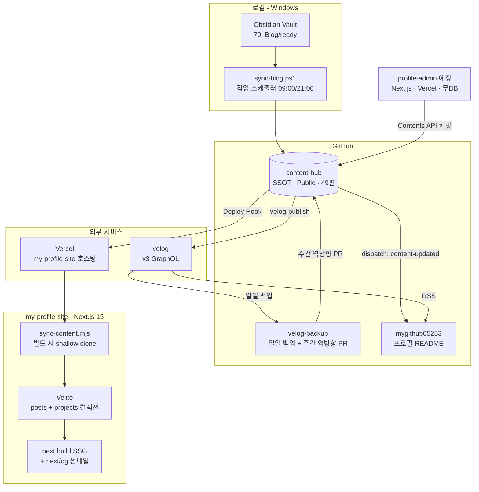
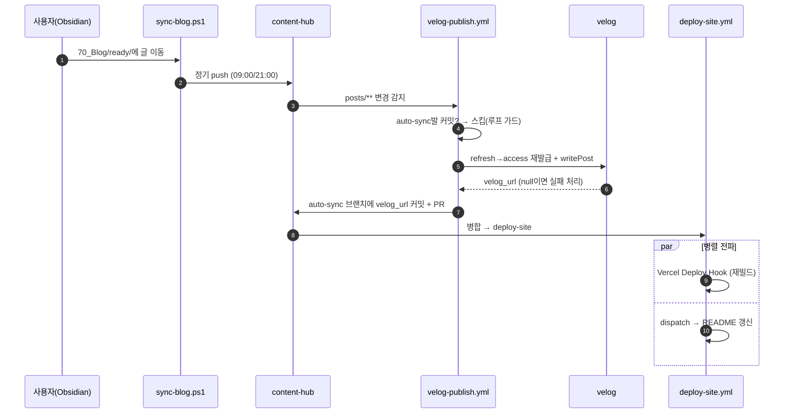
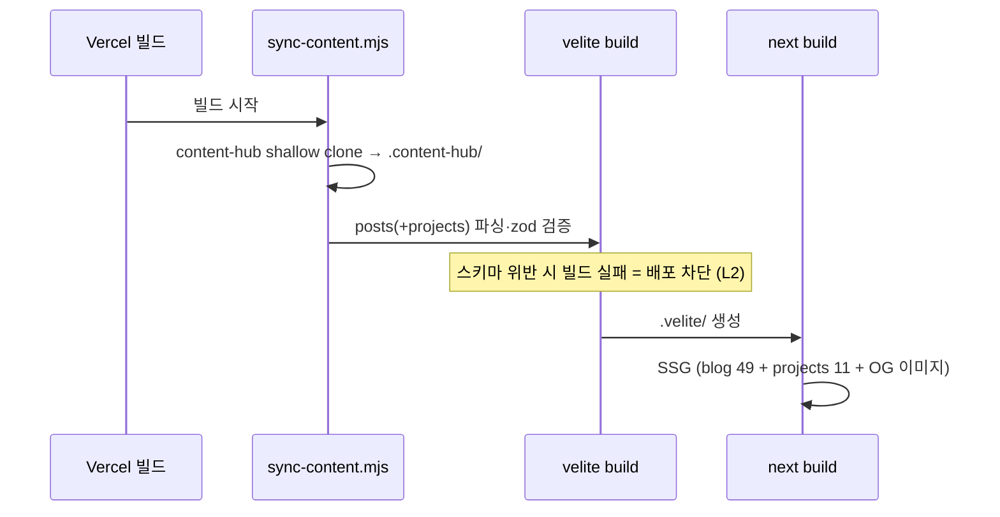
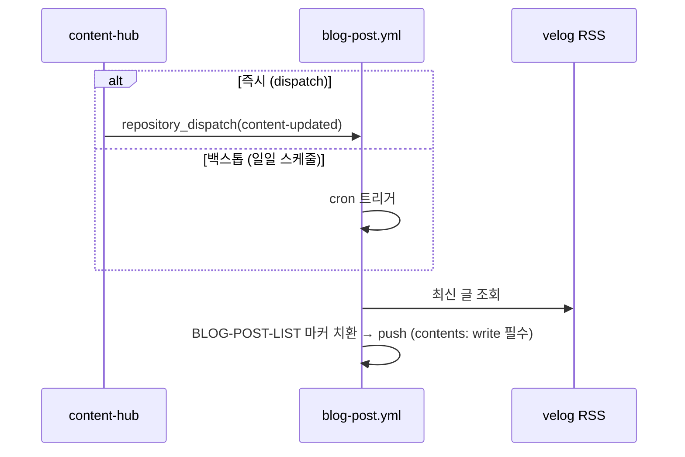
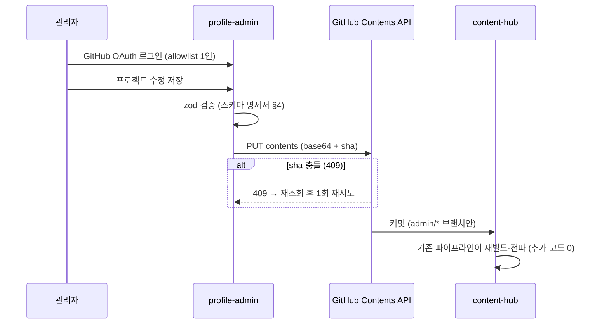

# 시스템 아키텍처 설계서 v1.0

> **프로젝트:** 개인 브랜딩 자동화 생태계 + 프로필 사이트
> **작성일:** 2026-07-04 (KST) | 상태: ■ 확정 (§1~§5 as-built 100% E2E 검증 완료, §6 profile-admin은 설계)
> 상위: 프로젝트 개요서 v1.0 · 연관: 연동 API 통합명세서 v1.0, 콘텐츠 스키마 명세서 v1.0

## 목차

1. [전체 시스템 구성도](#1-전체-시스템-구성도)
2. [레포 토폴로지 및 책임](#2-레포-토폴로지-및-책임)
3. [핵심 시퀀스 다이어그램 4종](#3-핵심-시퀀스-다이어그램-4종)
4. [인프라 구성](#4-인프라-구성)
5. [보안 설계 검토](#5-보안-설계-검토)
6. [profile-admin 아키텍처 (설계)](#6-profile-admin-아키텍처-설계)
7. [장애 시나리오 및 복구 정책](#7-장애-시나리오-및-복구-정책)
8. [아키텍처 결정 기록 (ADR)](#8-아키텍처-결정-기록-adr)

---

## 1. 전체 시스템 구성도

**설계 성격**: 중앙 서버·DB 없는 **이벤트 드리븐 정적 생성 아키텍처**. 모든 상태는 git(content-hub)에, 모든 연산은 GitHub Actions·Vercel 빌드·로컬 스케줄러에 위임.

## 2. 레포 토폴로지 및 책임

| 레포 | 책임 | 트리거 | 산출 |
|------|------|--------|------|
| content-hub | SSOT·검증 CI·velog 발행·전파 허브 | push/PR, 병합 | velog 글, Hook 호출, dispatch |
| velog-backup | velog → git 백업(일일), 역방향 diff PR(주간 월 09:00) | schedule | 백업 커밋, content-hub PR |
| my-profile-site | 사이트 SSG + OG | Vercel(Hook/push) | 배포 (my-profile-site-coral.vercel.app) |
| mygithub05253 | README 마커 갱신 | dispatch + 일일 schedule | README 커밋 |
| profile-admin (예정) | 콘텐츠 CRUD 웹 | 관리자 조작 | content-hub 커밋 |

**결합 규칙**: 레포 간 결합은 ① git clone ② HTTP(Hook/dispatch/GraphQL) 두 종류만. 코드 수준 공유 없음 (독립 배포·독립 실패).

## 3. 핵심 시퀀스 다이어그램 4종

### 3.1 글 발행 전파 (E2E 검증 완료)

### 3.2 사이트 빌드 파이프라인

### 3.3 README 갱신 (즉시 + 백스톱)

### 3.4 profile-admin 콘텐츠 수정 (설계)

## 4. 인프라 구성

| 계층 | 구성 | 비용 |
|------|------|------|
| 호스팅 | Vercel (계정 dongwon-lees-projects-ee25ca1b, Deploy Hook) | Free tier |
| CI/CD | GitHub Actions (validate·velog-publish·deploy-site·백업·blog-post) | Free tier |
| 로컬 자동화 | Windows 작업 스케줄러 2건 (sync-blog am/pm) | — |
| 콘텐츠 저장 | GitHub 레포 (git = 감사 로그·백업) | — |
| 폰트/OG | next/og + Google Fonts css2 `text=` 서브셋 (satori는 woff2 불가 → TTF) | 빌드 시 |

## 5. 보안 설계 검토

### 5.1 자산 및 위협 (경량 STRIDE)

| 자산 | 위협 | 대응 |
|------|------|------|
| velog 계정 | refresh token 유출 → 계정 탈취 | Secrets 저장 한정, 30일 수명, 평문 노출 시 즉시 회전 (이력 1건 — 회전 권고됨) |
| content-hub main | 워크플로 오동작·외부 PR로 오염 | main 직접 커밋 금지, 자동화는 auto-sync 브랜치 전용, PR 병합은 사용자 승인 |
| PAT 2종 | 과잉 스코프 시 피해 확산 | fine-grained 최소 스코프 (403 결함 2건이 역설적으로 최소권한 증빙) |
| profile-admin | 인증 우회 → 콘텐츠 변조 | OAuth allowlist 1인, 모든 라우트 미들웨어 강제, 클라이언트에 PAT 미노출(서버 env) |
| 사이트 | XSS (MDX 렌더링) | 신뢰 소스(본인 콘텐츠)만 렌더 + raw HTML 미허용 유지 |

### 5.2 비밀 관리 원칙

1. 모든 비밀은 GitHub Secrets / Vercel env에만 — 코드·문서·채팅 평문 금지
2. Private 레포 정보(credible-stock-research 등)는 사이트에 콘텐츠만 게재, 레포 링크 비노출 (repoVisibility)
3. 토큰 만료 캘린더를 마스터인덱스에서 추적 (VELOG_REFRESH_TOKEN 2026-08-02)

## 6. profile-admin 아키텍처 (설계)

- **레포 분리 확정 (ADR-9)**: 사용자 화면(my-profile-site)과 관리자 화면(profile-admin)은 **개인 계정 내 별도 레포**. Organization 분리는 하지 않음 — 개인 계정 루트 프로필 README(mygithub05253) 유지가 우선. 분리 근거: 배포·인증 경계 분리(관리자 앱만 OAuth Secrets 보유), 독립 릴리스, 포트폴리오 서사 독립성
- **무DB 원칙**: 상태는 전부 content-hub. profile-admin은 stateless 프록시 + 편집 UI
- 스택: Next.js(App Router) + NextAuth(GitHub OAuth) + Route Handlers → GitHub Contents API
- 배포: 별도 레포 + Vercel. 디자인 토큰은 **npm 패키지 공유 확정 (ADR-10, R-4)** — `@mygithub05253/profile-tokens`(GitHub Packages, 순수 CSS 변수 tokens.css만 배포). 각 앱은 `globals.css`에서 `@import` 후 자체 `@theme` 블록에서 `var()` 브리지 매핑(Tailwind v4 표준 — 패키지를 Tailwind 버전 독립 유지). 변경 전파: `npm version` → publish → 각 앱 `npm update` (semver 명시적 업그레이드)
- 저장 방식 확정 (D-2 (b)): 브랜치 커밋(다중 파일은 Git Database API 원자 커밋) → PR → **auto-merge** → CI(L1) 통과 시 자동 병합 (상세: 관리자 API §3.2)
- 인증 경계 (R-2 확정): 미들웨어에서 세션 + GitHub **숫자 ID** allowlist 이중 확인 (signIn 콜백 + authorized 콜백). 실패 시 403 고정 응답
- 확장 경로: P0 프로젝트 CRUD → P1 초안 관리(drafts→posts 승격) + 이미지 업로드(FR-M22) → P2 Actions 실행 이력 대시보드 → P3 정적 데이터 편집(FR-M23, ADR-11)

## 7. 장애 시나리오 및 복구 정책

| # | 시나리오 | 영향 | 복구 |
|---|----------|------|------|
| F-1 | velog API 파손(비공식) | 발행 중단 | 상태 ready 유지 → velog_ready/ 수동 발행. 사이트·README는 무영향 (독립 채널) |
| F-2 | refresh token 만료 | 발행·백업 실패 | 수동 재발급 → Secret 교체 (30일 캘린더 관리) |
| F-3 | Vercel 빌드 실패 (L2 검증) | 신규 배포 차단 | 이전 배포 자동 유지 (fail-safe). 스키마 수정 후 재병합 |
| F-4 | dispatch 403 | README 즉시 갱신 지연 | 일일 스케줄 백스톱이 자동 복구 (기능 공백 = 지연뿐) |
| F-5 | 로컬 스케줄러 미동작 | Obsidian 동기화 지연 | 수동 push 가능. 데이터 손실 없음 (Vault 원본 보존) |
| F-6 | content-hub 저장소 손상 | SSOT 손실 | git 분산 사본(로컬·Vercel 캐시·velog-backup 역사본)로 복원 |

**총평**: 단일 장애점은 content-hub지만 git 특성상 사본이 4곳 이상 존재. 나머지 채널은 전부 독립 실패·자동 백스톱 구조.

## 8. 아키텍처 결정 기록 (ADR)

| ADR | 결정 | 근거 | 날짜 |
|-----|------|------|------|
| ADR-1 | Vercel 호스팅 + Deploy Hook | GitHub Pages 대비 OG 동적 생성·재빌드 트리거 용이 | 2026-07-03 |
| ADR-2 | velog 완전 자동 발행 + velog_ready 폴백 | 비공식 API 리스크를 폴백으로 흡수 | 2026-07-03 |
| ADR-3 | content-hub Public | 포트폴리오 서사 + RSS/clone 무인증 | 2026-07-03 |
| ADR-4 | Obsidian 우선, Vault 전체 git화 금지 | 26,000+ 파일·Google Drive 충돌 위험 | 2026-07-03 |
| ADR-5 | Velite 채택 (contentlayer 금지) | Next.js 15 호환·zod 내장 | 2026-07-03 |
| ADR-6 | 프로젝트 콘텐츠 B안(content-hub 통합) | SSOT 일관 + 관리자 웹 CRUD 단일 대상 | 2026-07-04 |
| ADR-7 | profile-admin 무DB(GitHub API 저장) | DB 운영비 0 + 기존 파이프라인 재사용 | 2026-07-04 |
| ADR-8 | 디자인 C안 Signal (듀얼 테마 + Signal Blue) | 금융 신뢰 시맨틱 + AA 대비 | 2026-07-04 |
| ADR-9 | 사용자/관리자 **레포 분리** (개인 계정 내, Organization 미사용) — **D-4 최종 확정** | 인증 경계·독립 배포 + 프로필 README 유지 | 2026-07-04 |
| ADR-10 | 디자인 토큰 **npm 패키지 공유** (`@mygithub05253/profile-tokens`, GitHub Packages) — 복사·submodule·모노레포 기각 | 변경 빈도 낮을수록 semver 명시적 업그레이드가 장점, drift 방지 + 1인 유지보수 균형 (R-4) | 2026-07-04 |
| ADR-11 | 정적 데이터(records/stacks/profile) **content-hub `data/` YAML 이관** + admin P3 CRUD — D-1 (b)+(c) | "코드 수정 없이 관리" 목표(검토 F-4) 충족, SSOT 일관 | 2026-07-04 |
| ADR-12 | 디자인 **Warm Paper 전환** (웜 크림+오렌지, 라이트 기본, Nunito 디스플레이, 곰돌이 마스코트) — **ADR-8(C안 Signal) 대체** | 사용자 지정(lova-clover.github.io 벤치마킹, 2026-07-05). 토큰 이름 유지·값만 교체로 컴포넌트 무수정 전환 | 2026-07-05 |
