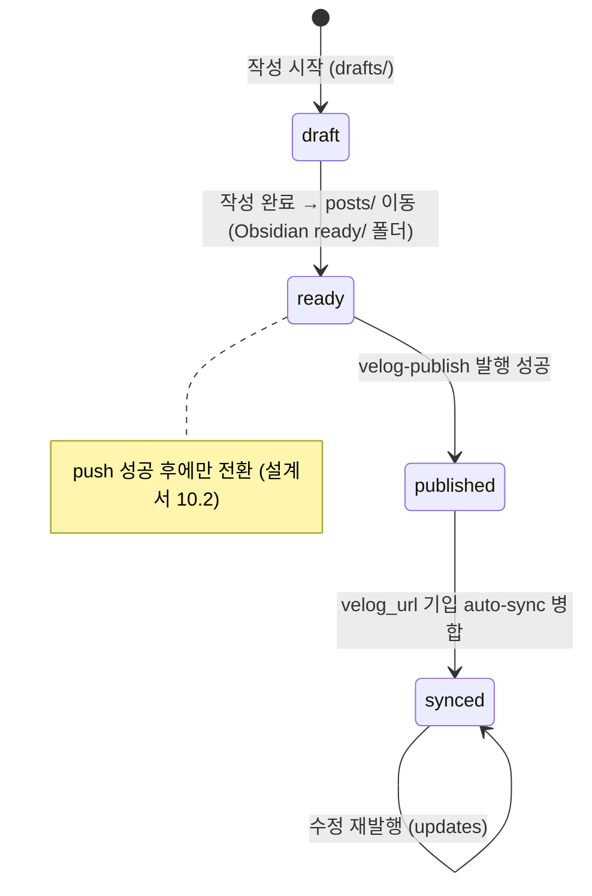

# 콘텐츠 스키마 명세서 (ERD 대응) v1.0

> **프로젝트:** 개인 브랜딩 자동화 생태계 + 프로필 사이트
> **작성일:** 2026-07-04 (KST) | 상태: ■ 확정 (posts=as-built, projects=구현 기준 확정 설계)
> **저장소 모델:** RDB가 아닌 **파일 기반 SSOT** (content-hub 레포의 Markdown/MDX frontmatter가 스키마 역할)
> 본 문서는 gc-dating-app ERD 명세서 격식을 파일 기반 스키마에 대응시킨 것이다. 컬렉션=테이블, frontmatter 필드=컬럼, slug=PK로 읽는다.

## 목차

1. [저장소 토폴로지 및 디렉터리 구조](#1-저장소-토폴로지-및-디렉터리-구조)
2. [컬렉션 목록 (테이블 대응)](#2-컬렉션-목록)
3. [posts 컬렉션 스키마 (as-built)](#3-posts-컬렉션-스키마-as-built)
4. [projects 컬렉션 스키마 (신설, PR-A 대상)](#4-projects-컬렉션-스키마-신설)
5. [상태 전이 모델](#5-상태-전이-모델)
6. [식별자(slug) 규칙 및 제약](#6-식별자slug-규칙-및-제약)
7. [Velite 소비 스키마 (사이트 측)](#7-velite-소비-스키마-사이트-측)
8. [사이트 내장 정적 데이터](#8-사이트-내장-정적-데이터)
9. [검증 계층 및 정합성 매트릭스](#9-검증-계층-및-정합성-매트릭스)
10. [설계 근거](#10-설계-근거)

---

## 1. 저장소 토폴로지 및 디렉터리 구조

```
content-hub/  (Public, SSOT)
├─ posts/               # 발행 대상 글 (status: ready 이상만 허용)
├─ drafts/              # 초안 (status: draft 전용)
├─ projects/            # ★ 신설(PR-A) — type: project MDX, velog 발행 제외
├─ data/                # ★ 신설(D-1 확정) — records/stacks/profile 구조화 데이터 (YAML)
├─ assets/              # 이미지 (thumbnail 상대 경로 대상 + admin 업로드 대상)
└─ scripts/             # validate_frontmatter.py · velog_publish.py · sync-blog.ps1
```

- 소비자: my-profile-site(`scripts/sync-content.mjs`가 빌드 시 shallow clone → `.content-hub/`), velog-publish 워크플로, mygithub05253 README(RSS 경유)
- **불변식**: 콘텐츠 원본은 content-hub에만 존재. 사이트 레포에는 콘텐츠를 두지 않는다 (NFR SSOT)

## 2. 컬렉션 목록

| # | 컬렉션 | 물리 위치 | PK | 상태 | 용도 |
|---|--------|-----------|-----|------|------|
| 1 | posts | `posts/**/*.md` | slug | ✅ 운영 (49편) | 블로그 글 (velog 발행 대상) |
| 2 | drafts | `drafts/**/*.md` | slug | ✅ 운영 | 초안 (posts와 동일 스키마, status=draft) |
| 3 | **projects** | `projects/*.mdx` | slug | 🔶 PR-A 신설 | 프로젝트 상세 (velog 발행 제외) |
| 4 | **records** | `data/records.yml` | id | 🔶 PR-D 선행 신설 (D-1 확정) | 이력·수상·교육·자격 타임라인 |
| 5 | **stacks** | `data/stacks.yml` | name | 🔶 PR-D 선행 신설 (D-1 확정) | 기술 스택 (주력/학습 2그룹) |
| 6 | **profile** | `data/profile.yml` | — (단일 문서) | 🔶 PR-D 선행 신설 (D-1 확정) | Hero 문구·연락처·소셜 링크 |

## 3. posts 컬렉션 스키마 (as-built)

> 근거 코드: `content-hub/scripts/validate_frontmatter.py` + `my-profile-site/velite.config.ts` (2026-07-04 기준 일치 확인)

| 필드 | 한글명 | 타입 | 제약 | 설명 |
|------|--------|------|------|------|
| `title` | 제목 | string | **NOT NULL** | |
| `slug` | 식별자 | string | **PK, NOT NULL, UNIQUE, 불변** | 파일명(stem)과 일치 필수. 6장 패턴 준수 |
| `type` | 유형 | enum | NOT NULL | `post` / `retrospective` / `project` |
| `date` | 작성일 | date | NOT NULL | `YYYY-MM-DD` (ISO) |
| `tags` | 태그 | string[] | NOT NULL (빈 배열 허용) | **velog API required 배열 — 생략·문자열 금지** |
| `series` | 시리즈 | string | NULL | Velite 측 optional |
| `source` | 원천 | enum | NOT NULL | `obsidian` / `notion` / `velog` |
| `status` | 상태 | enum | NOT NULL | `draft` / `ready` / `published` / `synced` (5장 전이 규칙) |
| `velog_url` | velog 주소 | string | NULL | velog-publish가 auto-sync 커밋으로 기입 |
| `visibility` | 공개 여부 | enum | NOT NULL | `public` / `private` |
| `thumbnail` | 썸네일 | string | NULL, 경로 존재 검증 | 없으면 next/og 자동 생성 |
| `aliases` | 구 slug 별칭 | string[] | NULL | slug 불변 원칙 하 리다이렉트용 (설계서 10.2) |

**CHECK 제약 (CI 강제)**
- C-1: `status=draft` 파일은 `posts/`에 존재 금지 (drafts/ 전용)
- C-2: slug 전역 UNIQUE (validate가 전 파일 스캔으로 중복 감지)
- C-3: thumbnail 지정 시 레포 내 실제 경로 존재

**사이트 노출 조건 (파생 뷰)**: `visibility == public AND status IN (published, synced)`

## 4. projects 컬렉션 스키마 (신설)

> 요구사항 정의서 v1.0 6장 확정 스키마. PR-A에서 validate_frontmatter.py에 검증 추가.

| 필드 | 한글명 | 타입 | 제약 | 설명 |
|------|--------|------|------|------|
| `title` | 프로젝트명 | string | **NOT NULL** | |
| `slug` | 식별자 | string | **PK, NOT NULL, UNIQUE, 불변** | posts와 동일 규칙·동일 네임스페이스에서 중복 검사 |
| `type` | 유형 | enum | NOT NULL, = `project` 고정 | posts와 구분자 |
| `category` | 도메인 축 | enum[] | NOT NULL, ≥1 | `ai-data` / `finance` / `fullstack` |
| `scope` | 참여 축 | enum | NOT NULL | `personal` / `team` — 필터 Personal/Team 매핑 |
| `role` | 역할 | string | **scope=team일 때 NOT NULL** | 예: "4인 팀 — 백엔드/데이터 담당" |
| `period` | 기간 | string | NOT NULL | `YYYY-MM ~ YYYY-MM` (mono 렌더링) |
| `stack` | 기술 스택 | string[] | NOT NULL, ≥1 | 카드 아이콘 최대 3+N |
| `summary` | 한 줄 요약 | string | NOT NULL | 카드용 |
| `thumbnail` | 썸네일 | string | NULL | 없으면 next/og 자동 생성 |
| `github` | 레포 URL | string | NULL | |
| `repoVisibility` | 레포 공개성 | enum | NOT NULL | `public` / `private` — private → GitHub 버튼 비노출 + 배지 |
| `demo` | 데모 URL | string | NULL | |
| `featured` | 홈 노출 | boolean | NOT NULL, default false | 홈 Featured 3~4건 |
| `order` | 정렬 순서 | number | NOT NULL | featured 우선 → order ASC |
| `status` | 상태 | enum | NOT NULL | `draft` / `published` |

**CHECK 제약 (PR-A에서 CI 추가)**
- P-1: `scope=team` ⇒ `role` 필수
- P-2: `category` ⊆ {ai-data, finance, fullstack}, 1개 이상
- P-3: `repoVisibility=private` ⇒ 사이트가 GitHub 버튼 렌더링 금지 (UI 계층 강제)
- P-4: `projects/` 경로는 velog-publish **제외** (경로 필터 — API 명세서 2.4)
- P-5: `type=project` ⇒ `status ∈ {draft, published}` — 공통 enum(ready/synced)의 유령 상태 유입 차단 (검토 F-1)
- P-6: slug 유일성 스캔에 **projects/ 포함** — collect_targets 확장, 전 컬렉션 공통 네임스페이스 실검증 (검토 F-2)
- P-7: `type=project` ⇔ 경로 `projects/` — posts/에 type:project 혼입 시 블로그 노출 사고 차단, 역방향(projects/ 내 type≠project)도 금지 (검토 F-3)

**본문(MDX) 표준 구조**: 문제 정의 → 구현(아키텍처 다이어그램) → 성과(수치) → 트러블슈팅 → 배운 점 (STAR)

### 4.1 초기 데이터 (게재 확정 11건)

| # | slug(안) | category | scope | repoVisibility |
|---|----------|----------|-------|----------------|
| 1 | est-camp-ai-quant | ai-data, finance | personal | public |
| 2 | dacon | ai-data | personal | public |
| 3 | research-prompt-engineering | ai-data | team | public |
| 4 | credible-stock-research | finance, ai-data | personal | public (**D-3 확정: 공개 전환** — 사용자가 레포 설정 변경 필요) |
| 5 | stock-agent | finance, ai-data | team | public (fork) |
| 6 | universal-ai-skills | fullstack | personal | public |
| 7 | emoji-diary-final | fullstack | team | public |
| 8 | gc-dating-app | fullstack | team | public (fork) |
| 9 | unstructured-data-processing | ai-data | team | **private** |
| 10 | profile-admin | fullstack | personal | public (신규 기획) |
| 11 | automation-ecosystem | fullstack | personal | public (4-레포) |

## 5. 상태 전이 모델



- projects는 `draft → published` 2단계 (velog 발행 없음)
- **전이 주체**: draft→ready는 사람(폴더 이동), ready→published/synced는 워크플로 자동. 역방향 전이 금지

## 6. 식별자(slug) 규칙 및 제약

- 패턴: `^[A-Za-z0-9가-힣.]+(?:-[A-Za-z0-9가-힣.]+)*$` — 한글·대소문자·점 허용 (velog url_slug 보존, 예: `Node.js`)
- **불변 원칙**: 발행 후 slug 변경 금지. 변경 필요 시 `aliases`에 구 slug 보존
- 파일명 = slug (stem 일치 검증), 전 컬렉션(posts+drafts+projects) 공통 네임스페이스에서 UNIQUE
- URL 인코딩: 사이트 permalink는 `encodeURIComponent(slug)` (한글 대응)

## 7. Velite 소비 스키마 (사이트 측)

- 현행: `posts` 컬렉션 1개 (`velite.config.ts`, 3장과 필드 일치)
- **PR-C 추가분**: `projects` 컬렉션 — `pattern: "projects/*.mdx"`, 4장 스키마의 zod 대응 + `permalink: /projects/${slug}` transform
- 빌드 순서 고정: `sync-content.mjs`(clone) → `velite build`(.velite/) → `next build`. contentlayer/next-mdx-remote 금지

## 8. 구조화 정적 데이터 — content-hub `data/` (D-1 확정: (b)+(c))

records/stacks/profile은 **content-hub `data/` YAML로 이관**한다 (D-1 (b), 2026-07-04 확정). "코드 수정 없이 관리" 목표(검토 F-4) 충족 + admin CRUD 대상화(D-1 (c) — FR-M23, P3).

| 파일 | 스키마 | 소비처 |
|------|--------|--------|
| `data/records.yml` | `{ id, date(YYYY-MM), title, org, kind: activity\|award\|education\|cert, detail? }[]` | Records 타임라인 |
| `data/stacks.yml` | `{ name, group: main\|learning, icon }[]` | Stack 섹션, ProjectCard 아이콘 |
| `data/profile.yml` | Hero 문구·연락처·소셜 링크 (단일 문서) | Hero / Contact / Footer |

- 소비 방식: 사이트 빌드 시 `sync-content.mjs` clone에 포함 → 사이트 측 zod 파싱(L2). 타입 정의는 사이트 레포 `src/types/`에 유지
- 구현 시점: **PR-D 선행 커밋**으로 content-hub에 data/ 추가 (PR-A 범위 아님). L1 YAML 검증은 스키마 v1.1 후보
- admin 편집: FR-M23 (P3) — projects와 동일 저장 흐름(PR + auto-merge) 재사용

## 9. 검증 계층 및 정합성 매트릭스

| 계층 | 도구 | 시점 | 실패 시 |
|------|------|------|---------|
| L1 스키마 검증 | validate_frontmatter.py — **PR-A에서 projects/ 스캔 포함 + type 조건부 검증(P-5~P-7)으로 확장** | content-hub PR CI | 병합 차단 |
| L2 타입 검증 | Velite(zod) | 사이트 빌드 | 빌드 실패 → 배포 차단 |
| L3 발행 검증 | velog_publish.py | 발행 시 | null 응답=실패 처리 |

**정합성 매트릭스 (필드 소유권)**

| 필드 | validate(L1) | Velite(L2) | 비고 |
|------|--------------|-----------|------|
| posts 필수 8종 | ✅ | ✅ | 일치 확인(2026-07-04) |
| `series` | — (미검증) | optional | L1 추가는 선택 과제 |
| `thumbnail` 경로 존재 | ✅ | — | L1 전용 |
| projects 필드 | 🔶 PR-A | 🔶 PR-C | **PR-A가 L2보다 선행 필수** |

## 10. 설계 근거

1. **파일 기반 SSOT 채택**: 콘텐츠 규모(수십~수백 편)에서 DB는 과잉. git 이력이 감사 로그를 대체하고, PR이 트랜잭션 역할
2. **B안(content-hub 통합)**: 프로젝트를 별도 레포/사이트 내장으로 두면 SSOT 위반 + 관리자 웹 CRUD 대상 분산 → `type: project`로 통합 (의사결정 3, 2026-07-04)
3. **2축 분류(category[]×scope)**: 단일 카테고리로는 "AI이면서 금융, 팀" 표현 불가 → 도메인 다중 + 참여 단일의 직교 축
4. **slug 한글 허용**: velog 백필 49편의 url_slug 보존 요구 (구현 중 발견 결함 → 패턴 완화, content-hub PR #4)
