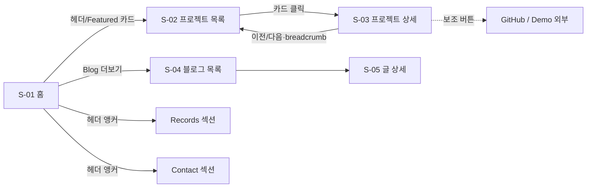

# UI 통합설계서 v1.1

> **프로젝트:** 프로필 사이트 재설계 + profile-admin
> **작성일:** 2026-07-04 (KST) | 상태: ■ 확정 (사이트) / 초안 (admin 화면 §7)
> **베이스:** `ui/version1.0/` 4종(요구사항 정의서·디자인시스템 검토서·DESIGN.md·UI 명세서) — 본 v1.1은 이를 **화면 ID 체계 + 화면별 설계 격식**(캡스톤 설계서 5장 급)으로 통합·승격한 정본
> 디자인 토큰: DESIGN.md v1.0 (C안 Signal, 듀얼 테마) — 본 문서에서 재정의하지 않고 참조만 한다

## 목차

1. [화면 ID 체계 및 사이트맵](#1-화면-id-체계-및-사이트맵)
2. [스토리보드(메뉴) 구성](#2-스토리보드메뉴-구성)
3. [공통 레이아웃 (S-00)](#3-공통-레이아웃-s-00)
4. [사용자 화면설계 — 홈·프로젝트 (S-01~S-03)](#4-사용자-화면설계--홈프로젝트)
5. [사용자 화면설계 — 블로그 (S-04~S-05)](#5-사용자-화면설계--블로그)
6. [컴포넌트 인벤토리 및 상태 정의](#6-컴포넌트-인벤토리-및-상태-정의)
7. [관리자 화면설계 — profile-admin (A-01~A-05)](#7-관리자-화면설계--profile-admin)
8. [반응형·접근성·모션 규칙](#8-반응형접근성모션-규칙)
9. [구현 순서 (PR 분할)](#9-구현-순서-pr-분할)

---

## 1. 화면 ID 체계 및 사이트맵

| 화면 ID | 라우트 | 화면명 | 렌더링 | 구현 PR |
|---------|--------|--------|--------|---------|
| S-01 | `/` | 홈 랜딩 | SSG | PR-D |
| S-02 | `/projects` | 프로젝트 목록 | SSG + 클라이언트 필터 | PR-C |
| S-03 | `/projects/[slug]` | 프로젝트 상세 | SSG (11페이지) | PR-C |
| S-04 | `/blog` | 블로그 목록 | SSG (기존+재스킨) | PR-B |
| S-05 | `/blog/[slug]` | 블로그 상세 | SSG (49페이지) | PR-B |
| S-90 | `*` | 404 | 정적 | PR-B |
| A-01 | admin `/login` | 관리자 로그인 | — | Phase 7 |
| A-02 | admin `/projects` | 프로젝트 관리 목록 | — | Phase 7 |
| A-03 | admin `/projects/[slug]` | 프로젝트 편집 | — | Phase 7 |
| A-04 | admin `/drafts` | 초안 관리 (P1) | — | Phase 7 |
| A-05 | admin `/dashboard` | 발행 대시보드 (P2) | — | Phase 7 |

## 2. 스토리보드(메뉴) 구성



- 전역 내비: `[DW.] ─ Projects · Blog · Records · Contact ─ [🌓]` — 홈에서는 섹션 앵커, 서브 페이지에서는 라우트 이동(Records·Contact는 `/#records` 형태)
- 이탈 최소 원칙: 프로젝트 상세는 사이트 내 소비가 1차, 외부(GitHub/Demo)는 Secondary 버튼 (UC-02)

## 3. 공통 레이아웃 (S-00)

### 3.1 헤더
- 고정(sticky), 스크롤 시 배경 블러 + `--border` 하단선. 높이 64px
- 로고: 텍스트 워드마크 "DW." → `/`. 우측 끝 ThemeToggle
- 모바일: 햄버거 → 풀스크린 오버레이 (내비 4항목 + 토글, 열림 시 body 스크롤 잠금, ESC/외부 탭 닫기)

### 3.2 푸터
- 3요소: GitHub·velog·이메일 링크 / © / **"이 사이트는 content-hub 기반으로 자동 배포됩니다"** (자동화 서사 노출 — 클릭 시 자동화 생태계 프로젝트 상세로 링크)

### 3.3 Section 컴포넌트
- 표준: 제목(h2, `--text-2xl`) + 선택적 부제 + 수직 패딩(모바일 64 / 데스크톱 96) — 전 섹션 리듬 통일

## 4. 사용자 화면설계 — 홈·프로젝트

### S-01 홈 랜딩

```
┌─ Hero ─────────────────────────────────────┐
│ 이동원                          h1 4xl/700  │
│ 금융을 향하는 풀스택 개발자      accent 태그  │
│ "한 번 쓰면 모든 곳에 반영된다" muted 1줄     │
│ [프로젝트 보기 Primary] [연락하기 Secondary] │
├─ About: 강점 4카드 (md 2×2 / 모바일 1열) ────┤
│ 자동화 설계·운영 │ 금융 도메인 학습            │
│ 팀 협업         │ 기록 습관(블로그 49+)       │
├─ Stack: 주력/학습 2그룹 아이콘+라벨 칩 ───────┤
├─ Featured Projects: featured 3~4 카드 ──────┤
│ [카드][카드][카드]        [전체 보기 →]      │
├─ Records: 수직 타임라인(기간 mono) ──────────┤
├─ Blog: 최신 3 (제목·날짜·태그) [더보기 →] ────┤
└─ Contact: 이메일 CTA + 소셜 아이콘 ──────────┘
```

- 섹션 진입 fade-up 1회(8px, stagger 80ms). Hero 문구는 콘텐츠 단계에서 확정(초안 표기)
- 강점 4카드: 아이콘 + 제목 + 2줄 설명, `--surface` 카드/`--radius-md`

### S-02 프로젝트 목록

```
h1 Projects  ·  부제 "총 N개"
[All][AI·Data][Finance][Fullstack][Personal][Team]   단일 선택 칩
┌썸네일 16:9┐ ┌──────┐ ┌──────┐
│칩·칩      │ │      │ │      │   lg 3열 / md 2열 / 모바일 1열
│제목       │ │      │ │      │
│한 줄 요약 │ │      │ │      │
│⚙ stack×3+N│ │      │ │      │
└──────────┘ └──────┘ └──────┘
```

- 상태: ① 기본 ② 필터 적용(URL `?filter=`) ③ 빈 결과("해당 카테고리 프로젝트 준비 중") ④ 카드 hover(surface 단차 + 썸네일 scale 1.02)
- Private: 우상단 `--warning` "비공개" 배지. 카드 전체가 단일 링크(내부 중첩 링크 금지)

### S-03 프로젝트 상세

```
← Projects                              breadcrumb
h1 프로젝트명                [비공개 배지?]
[ai-data][team] · 2026-03 ~ 2026-06(mono) · 역할
[GitHub에서 보기] [Live Demo]            Secondary
──────────────────────────────
대표 이미지 (있으면, --radius-lg)
MDX 본문: 문제 정의 → 구현(다이어그램) → 성과(mono+success) → 트러블슈팅 → 배운 점
──────────────────────────────
← 이전 프로젝트          다음 프로젝트 →
```

- repoVisibility=private: GitHub 버튼 미렌더(자리 유지 안 함) + 배지. demo 빈 값: 버튼 생략
- OG: 글별 `opengraph-image.tsx` (다크 토큰 고정)

## 5. 사용자 화면설계 — 블로그

- S-04/S-05: 기존 구현 유지, PR-B에서 신규 토큰 재스킨만. PostCard를 ProjectCard와 시각 정합(칩·라운드·hover 규칙 동일)
- S-05 MDX 컴포넌트는 S-03과 공유 (MDXComponents 단일 소스)

## 6. 컴포넌트 인벤토리 및 상태 정의

| 컴포넌트 | 사용처 | 상태(state) | 비고 |
|----------|--------|-------------|------|
| ThemeProvider/ThemeToggle | 전역 | dark/light × system/manual | FOUC 방지 인라인 스크립트 |
| Header | 전역 | top/scrolled, 모바일 open/closed | 블러+보더 전환 |
| Footer / Section | 전역 | — | §3 |
| FilterChips | S-02 | active(1)/inactive | 활성 `--accent-soft`+`--accent` |
| ProjectCard | S-01·S-02 | default/hover/focus | private 배지 변형 |
| Badge | 카드·상세 | warning(비공개)/category/scope | |
| StackIcon | Stack·카드 | — | simple-icons, 라벨 병기 |
| Timeline/TimelineItem | S-01 Records | — | 기간 `--font-mono` |
| PostCard | S-01·S-04 | default/hover | 재스킨 |
| MDXComponents | S-03·S-05 | — | 앵커·하이라이트·콜아웃·캡션 |
| PrevNextNav | S-03 | both/first/last | 단방향 끝 처리 |
| EmptyState | S-02·S-04 | — | 빈 결과 표준 문구 |

## 7. 관리자 화면설계 — profile-admin

### A-01 로그인
- 중앙 카드: 로고 + [GitHub로 로그인] 버튼 1개. 에러 배너(OAuth 실패/allowlist 거부 403 — "접근 권한이 없습니다" 고정 문구, 상세 사유 미노출)

### A-02 프로젝트 관리 목록
```
h1 Projects (N)                    [+ 새 프로젝트]
검색(제목) · 필터(status/category)
┌ 테이블: 제목 | category | scope | status | featured | 수정일 | ⋮ ┐
```
- 행 클릭 → A-03. ⋮ 메뉴: 편집/삭제. 삭제 = 모달 + **slug 재입력 확인** (FR-M17 Step 7)

### A-03 프로젝트 편집
```
┌ 좌: frontmatter 폼 ──────────┬ 우: MDX 에디터 ┐
│ title· slug(신규만 편집 가능) │ [작성|프리뷰] 탭 │
│ category(다중)·scope(단일)   │                │
│ role(scope=team 시 필수 표시) │                │
│ period·stack(태그 입력)      │                │
│ summary·github·demo·…      │                │
├──────────────────────────────┴───────────────┤
│ 상태 표시줄: idle→validating→committing→done   [저장] │
```
- 인라인 필드 에러(zod). dirty 이탈 경고. 409 충돌 시 diff 패널 + [덮어쓰기/취소]
- 모바일 대응: 폼/에디터 세로 스택 (관리자 1인 — 데스크톱 우선이되 붕괴 없음)

### A-04 초안 관리 (P1)
- drafts 목록 + 편집(A-03 폼 재사용, posts 스키마) + [발행 준비] → 확인 모달 "**velog에 자동 발행됩니다**"

### A-05 발행 대시보드 (P2)
- 상단: 워크플로 3종 최근 실행 카드(성공/실패·시각·로그 링크)
- 하단: 글별 상태 매트릭스 (status × velog_url × 사이트 노출)

### 디자인
- **사이트와 동일 DESIGN.md 토큰 재사용** (원칙 5). 관리 UI 특성상 밀도만 상향(spacing 1단계 축소 허용)

## 8. 반응형·접근성·모션 규칙

- 브레이크포인트/그리드: DESIGN.md 6장. 본문 최대폭 72rem
- 접근성: AA 대비(검증치 명기됨), 포커스 링, 시맨틱 랜드마크+스킵 링크, 햄버거 오버레이 포커스 트랩, 이미지 alt 필수
- 모션: fade-up 1회·hover 150ms·테마 250ms. `prefers-reduced-motion` 시 전부 비활성 (opacity 즉시)
- 카드 필터 전환: 그리드 리플로우만 (레이아웃 시프트 최소화, FLIP 애니메이션은 선택 과제)

## 9. 구현 순서 (PR 분할)

| PR | 대상 레포 | 내용 | 선행 |
|----|-----------|------|------|
| PR-A | content-hub | `projects/` 스키마·검증·velog-publish 경로 필터 + 샘플 1건 | — |
| PR-B | my-profile-site | 토큰·테마 토글·공통 컴포넌트 + DESIGN.md 루트 복사 + 블로그 재스킨 + 404 | — |
| PR-C | my-profile-site | S-02·S-03 + Velite projects 컬렉션 + 프로젝트 OG | PR-A |
| PR-D | my-profile-site | S-01 홈 재구성 + src/data 3종 | PR-B·C |
| 콘텐츠 | content-hub | 프로젝트 MDX 11건 (초안 → 사용자 검수) | PR-A |
| 검증 | — | /qa + /design-review → 배포 | 전체 |
| Phase 7 | profile-admin(신규 레포) | A-01~A-03 (P0) | 콘텐츠 안정화 |
