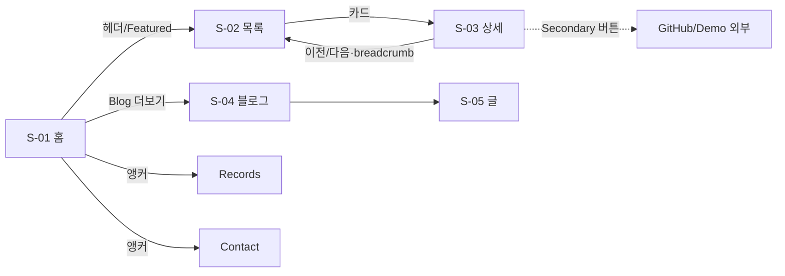

# 사용자(방문자) UI 설계서 v1.1

> **작성일:** 2026-07-04 (KST) | 상태: ■ 확정
> 대상: my-profile-site 방문자 화면 S-01~S-90. 관리자 화면(A-01~05)은 `ui/admin/version1.0/` (별도 레포 profile-admin — ADR-9)
> 디자인 토큰: `ui/version1.0/DESIGN.md` (C안 Signal) 참조 전용 — 재정의 금지

## 1. 화면 ID 및 사이트맵

| 화면 ID | 라우트 | 화면명 | 렌더링 | 구현 PR |
|---------|--------|--------|--------|---------|
| S-01 | `/` | 홈 랜딩 | SSG | PR-D |
| S-02 | `/projects` | 프로젝트 목록 | SSG + 클라이언트 필터 | PR-C |
| S-03 | `/projects/[slug]` | 프로젝트 상세 | SSG (11p) | PR-C |
| S-04 | `/blog` | 블로그 목록 | SSG (재스킨) | PR-B |
| S-05 | `/blog/[slug]` | 블로그 상세 | SSG (49p) | PR-B |
| S-90 | `*` | 404 | 정적 | PR-B |



- 전역 내비: `[DW.] ─ Projects · Blog · Records · Contact ─ [🌓]` — 홈=앵커, 서브=`/#records` 형태 라우트
- 이탈 최소: 상세는 사이트 내 소비 1차, 외부는 Secondary (UC-02)

## 2. 공통 레이아웃 (S-00)

- **헤더**: sticky 64px, 스크롤 시 블러+`--border` 하단선. 모바일 햄버거 → 풀스크린 오버레이(스크롤 잠금·ESC/외부 탭 닫기·포커스 트랩)
- **푸터**: GitHub·velog·이메일 / © / "이 사이트는 content-hub 기반으로 자동 배포됩니다" → 자동화 생태계 프로젝트 상세 링크
- **Section**: h2 `--text-2xl` + 수직 패딩(모바일 64/데스크톱 96) 리듬 통일

## 3. S-01 홈 랜딩

```
┌─ Hero ─────────────────────────────────────┐
│ 이동원                          h1 4xl/700  │
│ 금융을 향하는 풀스택 개발자      accent 태그  │
│ "한 번 쓰면 모든 곳에 반영된다" muted 1줄     │
│ [프로젝트 보기 Primary] [연락하기 Secondary] │
├─ About: 강점 4카드 (md 2×2 / 모바일 1열) ────┤
├─ Stack: 주력/학습 2그룹 아이콘+라벨 칩 ───────┤
├─ Featured Projects: featured 3~4 카드 ──────┤
├─ Records: 수직 타임라인 (기간 mono) ─────────┤
├─ Blog: 최신 3 [더보기 →] ────────────────────┤
└─ Contact: 이메일 CTA + 소셜 아이콘 ──────────┘
```
- fade-up 8px 1회·stagger 80ms (reduced-motion 비활성). Hero 문구 초안(콘텐츠 단계 확정 — 이슈 I-3)
- 빈 데이터 섹션은 통째로 비노출

## 4. S-02 프로젝트 목록

```
h1 Projects · 부제 "총 N개"
[All][AI·Data][Finance][Fullstack][Personal][Team]
┌썸네일 16:9┐ ┌──────┐ ┌──────┐   lg 3열 / md 2열 / 1열
│칩·칩 / 제목 / 한 줄 요약 / ⚙ stack×3+N│
```
- 상태 4종: 기본 / 필터 적용(`?filter=`) / 빈 결과("해당 카테고리 프로젝트 준비 중") / hover(surface 단차+썸네일 scale 1.02)
- Private: `--warning` "비공개" 배지. 카드 전체 단일 링크 (중첩 금지)

## 5. S-03 프로젝트 상세

```
← Projects (breadcrumb)
h1 프로젝트명 [비공개 배지?]
[ai-data][team] · 2026-03 ~ 2026-06(mono) · 역할
[GitHub에서 보기] [Live Demo]  ← Secondary, private=GitHub 미렌더
대표 이미지 (--radius-lg)
MDX: 문제 정의→구현→성과(mono+success)→트러블슈팅→배운 점
← 이전 프로젝트 · 다음 프로젝트 → (전역 정렬 기준, 필터 무관 — F-8)
```
- OG 글별 생성(다크 토큰 고정). MDX 컴포넌트는 S-05와 공유

## 6. S-04/S-05 블로그

- 기존 유지 + 신규 토큰 재스킨. PostCard는 ProjectCard와 시각 정합(칩·라운드·hover 동일)

## 7. 컴포넌트 인벤토리 (사용자 화면)

| 컴포넌트 | 사용처 | 상태 | 비고 |
|----------|--------|------|------|
| ThemeProvider/Toggle | 전역 | dark/light × system/manual | FOUC 방지 인라인 |
| Header | 전역 | top/scrolled·모바일 open/closed | |
| Footer / Section | 전역 | — | |
| FilterChips | S-02 | active(1)/inactive | `--accent-soft`+`--accent` |
| ProjectCard / Badge / StackIcon | S-01·02 | default/hover/focus | private 변형 |
| Timeline/TimelineItem | S-01 | — | 기간 mono |
| PostCard | S-01·04 | default/hover | 재스킨 |
| MDXComponents | S-03·05 | — | 앵커·하이라이트·콜아웃·캡션 |
| PrevNextNav | S-03 | both/first/last | 단방향 |
| EmptyState | S-02·04 | — | 표준 문구 |

## 8. 반응형·접근성·모션

- <768 1열·햄버거 / ≥768 2열 / ≥1024 3열·본문 72rem
- AA 대비·포커스 링·랜드마크+스킵 링크·이미지 alt 필수
- 모션: hover 150ms·테마 250ms·fade-up 1회. reduced-motion 시 전부 비활성

## 9. 구현 순서 (사용자 화면 관련)

PR-B(토큰·공통·재스킨·404) → PR-C(S-02/03+Velite projects+OG, **PR-A 선행**) → PR-D(S-01+src/data) → 콘텐츠 MDX 11건 → /qa·/design-review
