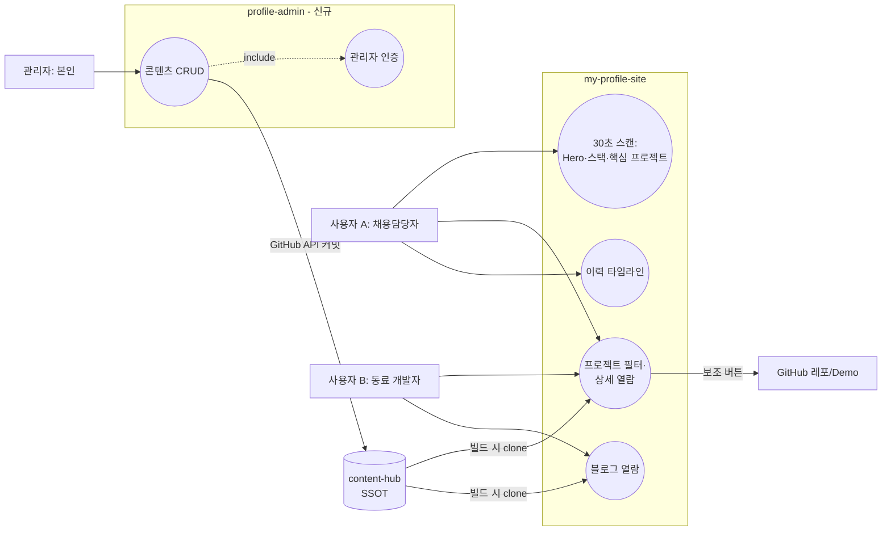

# 프로필 사이트 전면 재설계 — 요구사항 정의서 v1.0

> 작성일: 2026-07-04 (KST) · 상태: **확정** (사용자 의사결정 5건 반영, 2026-07-04)
> 벤치마킹: https://lova-clover.github.io (복제 아님 — 본인 상황에 맞게 재해석)

## 0. 확정된 의사결정 (2026-07-04)

| # | 항목 | 결정 |
|---|------|------|
| 1 | 핵심 프로젝트 | 사용자 지정 9개 레포 + **관리자 웹 신규 프로젝트** (4장) |
| 2 | 필터 카테고리 | All / AI·Data / Finance / Fullstack / **Personal / Team** |
| 3 | 콘텐츠 저장 위치 | **B안** — content-hub에 `type: project`로 통합 (SSOT 일관) |
| 4 | 디자인 방향 | **디자인 시스템부터 재검토** → `디자인시스템_검토서.md` 별도 진행 |
| 5 | (자동화 잔여) mygithub05253 PR #2 | 병합 완료 |

## 1. 배경 및 문제의식

Phase 2 재구축(v2)은 기존 정적 HTML을 Next.js로 **이관**한 수준에 그침:
요구사항·프로젝트 선정·사이트 내 상세 페이지·설계 문서·디자인 시스템 부재.
→ **정식 프로세스로 재설계**: 요구사항 → 프로젝트 선정 → IA/유스케이스 → 콘텐츠 스키마 → 디자인 시스템/UI 명세 → 구현.

## 2. 페르소나 및 유스케이스

### 2.1 페르소나
| 구분 | 페르소나 | 목표 |
|------|----------|------|
| 사용자 A | 채용담당자/현업 면접관 (30~60초 스캔) | 기술 스택·핵심 프로젝트·성과를 빠르게 판단 |
| 사용자 B | 동료 개발자/스터디원 | 블로그 글·프로젝트 구현 상세 열람 |
| 관리자 | 본인 (이동원) | **관리자 웹에서** 프로젝트/콘텐츠를 수정·추가·삭제 (코드 수정 없이) |

### 2.2 핵심 유스케이스
| ID | 액터 | 시나리오 |
|----|------|----------|
| UC-01 | 사용자 A | 랜딩 → 30초 내 Hero·스택·핵심 프로젝트 파악 → 연락처 도달 |
| UC-02 | 사용자 A/B | 프로젝트 목록 필터 → 카드 클릭 → **사이트 내 상세 페이지** (개요·역할·기술·성과·트러블슈팅) → 보조 버튼으로 GitHub/Demo 이동 |
| UC-03 | 사용자 B | 블로그 목록 → 글 상세 (content-hub 연동 유지) |
| UC-04 | 관리자 | 관리자 웹 로그인 → 프로젝트 등록/수정/삭제 → content-hub에 커밋 → 사이트 자동 재빌드 |
| UC-05 | 사용자 A | 이력/수상/자격 타임라인 열람 |

### 2.3 유스케이스 다이어그램



## 3. 벤치마킹 분석 (lova-clover.github.io) — 변경 없음

| 요소 | 벤치마킹 | 적용 |
|------|----------|------|
| 섹션 골격 | Hero → Focus → About → Stack → Projects(필터) → Records → Footer | 채택 + **Blog 섹션 추가** |
| 프로젝트 상세 | 모달 | **정적 상세 페이지** `/projects/[slug]` (SEO·OG·딥링크) |
| About 강점 4카드 · Records 타임라인 | 채택 | 자동화 생태계 운영 등 차별 강점으로 재작성 |

## 4. 게재 프로젝트 확정 목록 (사용자 지정, 2026-07-04)

| # | 레포 | 성격 | 카테고리(안)* | 비고 |
|---|------|------|---------------|------|
| 1 | EST-CAMP-AI-Quant | 이스트소프트 AI Quant 4기 부트캠프 | AI·Data, Finance, Personal | |
| 2 | Dacon | Dacon 공모전 참가 기록 | AI·Data, Personal | |
| 3 | Research-Prompt-Engineering | G.I.C 리서치 자동화 디벨롭 | AI·Data, Team | |
| 4 | credible-stock-research | 근거 신뢰도 중심 주식 리서치 도구 (stock-agent 후속) | Finance, AI·Data, Personal | ⚠ **Private** |
| 5 | stock-agent | BDAI PoCaT 금융 부트캠프 16주 팀 최종 | Finance, AI·Data, Team | fork |
| 6 | universal-ai-skills | Claude/Codex AX Skill 개발 (PromptOps) | Fullstack, Personal | |
| 7 | Emoji-Diary-Final | 가천대 P-실무 프로젝트 | Fullstack, Team | |
| 8 | gc-dating-app | 가천대 졸업 프로젝트 | Fullstack, Team | fork |
| 9 | unstructured-data-processing-final-project | ESG DART 비정형 데이터처리 팀 | AI·Data, Team | ⚠ **Private** |
| 10 | **profile-admin (신규 기획)** | 사이트 콘텐츠 관리자 웹 (사용자+관리자 기능 서사) | Fullstack, Personal | 5장 |
| 11 | **자동화 생태계** (content-hub·velog-backup·my-profile-site·mygithub05253) | 개인 브랜딩 CI/CD, 실운영 | Fullstack, Personal | 게재 확정 (2026-07-04) |

\* 카테고리 배정은 잠정 — 프로젝트별 MDX 작성 시 확정.

### 4.1 Private 레포 처리 방침
- 상세 페이지는 정상 제공 (콘텐츠는 사이트에 있으므로 무관)
- GitHub 버튼: Private이면 **비노출 + "비공개 프로젝트" 배지** 표시 (또는 공개 전환 시 버튼 활성) — frontmatter `repoVisibility` 필드로 제어
- 권장: credible-stock-research는 포트폴리오 효과를 위해 공개 전환 검토

### 4.2 추가 확정
- 자동화 생태계 게재: 사용자 승인 (2026-07-04) → #11로 추가. 총 **11건** (신규 기획 profile-admin 포함)

## 5. 신규 프로젝트: 관리자 웹 (profile-admin)

> 사용자 요구: "관리자 화면을 구현해서 수정/추가/삭제가 용이하도록 연결" — 그 자체가 포트폴리오 프로젝트(사용자+관리자 기능)

- **역할**: content-hub(SSOT)의 프로젝트/글 MDX를 웹 UI로 CRUD
- **아키텍처 방향 (서버리스 유지)**: 별도 레포 + Vercel 배포. 저장은 **GitHub API로 content-hub에 커밋** (DB 불필요, NFR-02 SSOT 유지 — 커밋 즉시 기존 파이프라인이 사이트 재빌드)
- **인증**: 관리자 1인 — GitHub OAuth(본인 계정만 허용) 또는 NextAuth credentials. 상세는 별도 설계서에서
- **범위**: 프로젝트 CRUD(P0) → 블로그 초안 관리(P1) → 발행 상태 대시보드(P2)
- **산출 문서**: `ui/version1.x/관리자웹_설계서.md` (요구사항·API·화면 정의) — 사이트 재설계 구현 후 착수 권장

## 6. 콘텐츠 스키마 확정 (B안 — content-hub 통합)

content-hub에 `projects/` 디렉터리 신설, `type: project` frontmatter:

```yaml
---
title: "프로젝트명"
slug: "project-slug"              # PK, 불변
type: project
category: [ai-data, finance]      # 도메인 축: ai-data | finance | fullstack
scope: personal | team            # 참여 축 (필터 Personal/Team 매핑)
role: "4인 팀 — 백엔드/데이터 담당" # team일 때 필수
period: "2026-03 ~ 2026-06"
stack: [Next.js, Python, MySQL]
summary: "카드용 한 줄 요약"
thumbnail: ""                      # 없으면 next/og 자동 생성
github: "https://github.com/..."
repoVisibility: public | private   # private → 버튼 비노출 + 배지
demo: ""
featured: true                     # 홈 노출 여부
order: 1
status: draft | published
---
본문(MDX): 문제 정의 → 구현(아키텍처 다이어그램) → 성과(수치) → 트러블슈팅 → 배운 점 (STAR)
```

**필터 매핑**: All(전체) / AI·Data / Finance / Fullstack = `category`, Personal / Team = `scope`. 단일 선택 칩 UI.

## 7. IA(정보 구조) 확정

```
/                 Hero → 강점 4카드 → Stack → Featured Projects → 활동/기록 타임라인 → 최신 블로그 3 → Contact
/projects         전체 목록 + 필터 칩 (All/AI·Data/Finance/Fullstack/Personal/Team)
/projects/[slug]  상세 (개요·역할·스택·성과·트러블슈팅 + GitHub/Demo 보조 버튼) + 글별 OG
/blog, /blog/[slug]  기존 유지
(관리자 웹은 별도 레포/도메인 — 5장)
```

## 8. 다음 단계

1. **디자인 시스템 검토** (결정 4) → `디자인시스템_검토서.md` — 방향 시안 제시 후 사용자 선택
2. 프로젝트별 MDX 콘텐츠 작성 (10건 — 각 레포 README 기반 초안 생성 후 사용자 검수)
3. UI 명세(와이어프레임·컴포넌트 정의) → 구현 → QA
4. 관리자 웹 설계서 착수 (구현 후순위)
